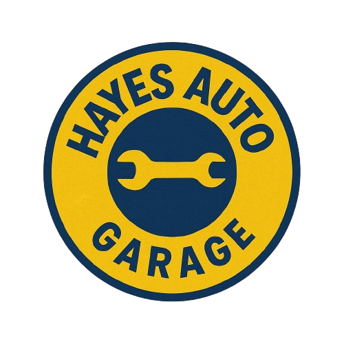

# Hayes Auto Garage – Application de gestion de comptabilité



## Présentation

**Hayes Auto Garage** est une application web complète de gestion pour un garage automobile. Elle permet de suivre les ventes, les partenariats (LSPD, EMS, etc.), le stock du coffre, les utilisateurs, ainsi que les statistiques clés du garage.  
L’application est responsive, sécurisée et pensée pour un usage quotidien par les équipes du garage.

---

## Fonctionnalités principales

- **Gestion des ventes** : Ajout, modification, suppression de ventes classiques ou sous contrat
- **Contrats partenaires** : Gestion des ventes partenaires (LSPD, EMS...) avec tarifs spécifiques et historiques dédiés
- **Suivi du stock du coffre** : Gestion des pièces et consommables avec décrémentation automatique lors des ventes/révisions
- **Historique & logs** : Export CSV détaillé des ventes et actions utilisateurs
- **Gestion des utilisateurs** : Création, modification, suppression, rôles (patron, employé)
- **Tableau de bord** : Statistiques, ventes par collaborateur, historique rapide
- **Notifications modernes** : Toastify.js pour les alertes et retours utilisateur
- **Sécurité renforcée** : Authentification, CSRF natif, contrôle d'accès par rôle, session centralisée via `BaseController`
- **Architecture MVC propre** : FastRoute, autoload Composer, structure modulaire

---

## Installation

1. **Cloner le projet**

   ```bash
   git clone https://github.com/votre-utilisateur/HayesAuto.git
   cd HayesAuto
   ```

````

2. **Installer les dépendances Composer**

   ```bash
   composer install
   ```

3. **Configurer la base de données**

   * Importer le fichier `hayesauto.sql` dans votre MySQL ou MariaDB
   * Modifier les identifiants dans `config/config.php`

4. **Vérifier les droits**

   * Le dossier `/logs` doit être accessible en écriture par le serveur web

5. **Lancer le serveur**

   * Via XAMPP, WAMP, MAMP ou serveur PHP intégré :

   ```bash
   php -S localhost:8000 -t public
   ```

6. **Accéder à l'application**

   [http://localhost:8000](http://localhost:8000)

---

## Structure du projet

```
HayesAuto/
│
├── app/                  # Contrôleurs, modèles et logique principale
│   ├── Controller/
│   ├── Core/
│   ├── Model/
│
├── config/               # Configuration
│   └── config.php
│
├── logs/                 # Fichiers d'historique CSV (non versionnés)
│
├── public/               # Racine web
│   ├── index.php
│   ├── assets/
│   │   ├── css/
│   │   ├── js/
│   │   ├── images/
│   │   └── data/         # Fichiers CSV véhicules
│
├── templates/            # Templates Twig
│
├── vendor/               # Dépendances Composer (non versionnées)
│
├── composer.json
├── .gitignore
└── README.md
```

---

## Technologies utilisées

* **PHP 8+**
* **MySQL / MariaDB**
* **Twig** pour les templates
* **FastRoute** pour le routing performant
* **Composer** pour la gestion des dépendances
* **HTML5 / CSS3**, Flexbox responsive
* **JavaScript**, Toastify.js, Select2
* **Logs CSV** par utilisateur et type d'action

---

## Bonnes pratiques intégrées

* Structure MVC simple et claire
* Contrôleur parent `BaseController` centralisant la session, le CSRF, le logger, PDO
* Sécurité CSRF intégrée sur les formulaires
* Routing moderne avec FastRoute
* Gestion des rôles (patron/employé) et contrôle des accès
* Séparation du code et des vues avec Twig
* Système de logs personnalisés par actions
* Préparation pour le déploiement multi-environnement

---

## Auteurs

* [Nerow75](https://github.com/Nerow75)

---

## Licence

Projet sous licence **MIT**, libre d'utilisation et de modification. Voir le fichier `LICENSE`.

---

**Hayes Auto Garage – La solution moderne et sécurisée pour piloter votre activité automobile 🚗🔧**

````
